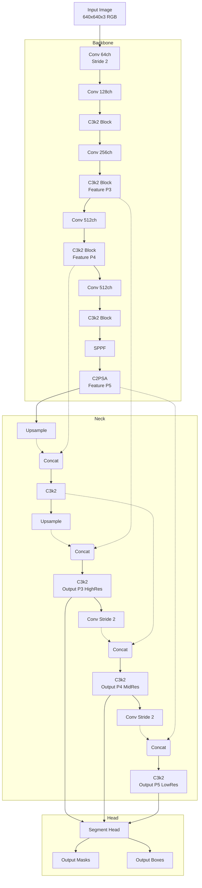

# Documentación Técnica de Arquitectura: YOLOv11l-seg (V3 Unified)

**Modelo:** YOLOv11l-seg (Large - Segmentation)
**Versión de Entrenamiento:** V3 Unified Final
**Dataset:** Pothole600 + Video Frames + MWPD + YOLOv8 Dataset (Unificado)

---

## 1. Especificaciones de Entrada (Input Layer)

Para efectos de diagramación, el flujo de datos comienza con:

*   **Dimensiones del Tensor:** `(Batch_Size, 3, 640, 640)`
*   **Resolución Espacial:** 640 x 640 píxeles.
*   **Canales:** 3 (RGB - Red, Green, Blue).
*   **Normalización:** Los valores de píxel `[0, 255]` son escalados a `[0.0, 1.0]`.

---

## 2. Resumen Macroscópico

La arquitectura se divide en tres bloques funcionales principales. Para un gráfico de alto nivel, utiliza esta estructura:

1.  **Backbone (CSPDarknet Mejorado):** Extracción de características. Reduce la dimensión espacial y aumenta la profundidad de canales. Utiliza bloques `C3k2` y `C2PSA`.
2.  **Neck (PANet):** Agregación de rutas (Path Aggregation Network). Mezcla características de diferentes escalas (FPN + PAN) para detectar objetos de distintos tamaños.
3.  **Head (Dual: Detect + Segment):**
    *   **Box Head:** Predice Bounding Boxes (xywh) y Clase.
    *   **Mask Head:** Genera máscaras de segmentación de instancias (Polígonos).

---

## 3. Desglose Detallado de Capas (Flujo de Datos)

A continuación se detalla la secuencia exacta de capas extraída de los logs de entrenamiento. Úsalo para construir el diagrama detallado.

### A. Backbone (Extracción de Features)

| Capa (Idx) | Tipo de Bloque | Argumentos / Configuración | Output Channels | Descripción |
| :--- | :--- | :--- | :--- | :--- |
| **0** | `Conv` | `[3, 64, 3, 2]` | 64 | Convolución inicial (Stride 2). Reduce tamaño. |
| **1** | `Conv` | `[64, 128, 3, 2]` | 128 | Downsample. |
| **2** | `C3k2` | `[128, 256, 2, True, 0.25]` | 256 | Bloque CSP con 2 repeticiones. |
| **3** | `Conv` | `[256, 256, 3, 2]` | 256 | Downsample. |
| **4** | `C3k2` | `[256, 512, 2, True, 0.25]` | 512 | Extracción profunda features medias. |
| **5** | `Conv` | `[512, 512, 3, 2]` | 512 | Downsample. |
| **6** | `C3k2` | `[512, 512, 2, True]` | 512 | Features de alta abstracción. |
| **7** | `Conv` | `[512, 512, 3, 2]` | 512 | Downsample Final. |
| **8** | `C3k2` | `[512, 512, 2, True]` | 512 | Bloque profundo. |
| **9** | `SPPF` | `[512, 512, 5]` | 512 | Spatial Pyramid Pooling - Fast. Aumenta campo receptivo. |
| **10** | `C2PSA` | `[512, 512, 2]` | 512 | **Feature Map P5** (Salida final del Backbone). |

### B. Neck (Fusión de Escalas)

El Neck utiliza conexiones "Upsample" (subida) y "Concat" (fusión lateral) para recuperar detalle espacial.

| Capa (Idx) | Tipo | input | Acción / Conexión |
| :--- | :--- | :--- | :--- |
| **11** | `Upsample` | De 10 | Escala x2 (Nearest Neighbor). |
| **12** | `Concat` | `[-1, 6]` | Concatena salida de Capa 11 con **Capa 6** (Skip Connection). |
| **13** | `C3k2` | Agregado | Procesa la fusión. Salida: 512 ch. |
| **14** | `Upsample` | De 13 | Escala x2. |
| **15** | `Concat` | `[-1, 4]` | Concatena salida de Capa 14 con **Capa 4** (Skip Connection). |
| **16** | `C3k2` | Agregado | Procesa fusión. **Salida P3** (Alta resolución espacial). |
| **17** | `Conv` | De 16 | Downsample (Stride 2). |
| **18** | `Concat` | `[-1, 13]` | Concatena con **Capa 13**. |
| **19** | `C3k2` | Agregado | Procesa. **Salida P4** (Resolución media). |
| **20** | `Conv` | De 19 | Downsample (Stride 2). |
| **21** | `Concat` | `[-1, 10]` | Concatena con **Capa 10**. |
| **22** | `C3k2` | Agregado | Procesa. **Salida P5** (Baja resolución, alta semántica). |

### C. Head (Segmentación)

La cabecera final recibe las tres escalas del Neck (P3, P4, P5) para realizar predicciones multi-escala.

| Capa (Idx) | Tipo | Inputs | Salida Final |
| :--- | :--- | :--- | :--- |
| **23** | `Segment` | `[16, 19, 22]` | **Detecciones + Máscaras**. Inputs: P3 (Capa 16), P4 (Capa 19), P5 (Capa 22). Canales Salida: `nc=1` (Clase "Pothole") + 32 proto-máscaras. |

---

## 4. Métricas de Complejidad

*   **Total de Capas:** 379
*   **Parámetros Totales:** 27,617,459 (27.6 Millones)
*   **GFLOPs:** 132.6 (Gigafloating-point operations per second)
*   **Gradientes:** 27,617,443

---

## 5. Sugerencia para Diagrama (Mermaid)

Puedes usar este código Mermaid para generar un gráfico de flujo básico de la arquitectura documentada:

