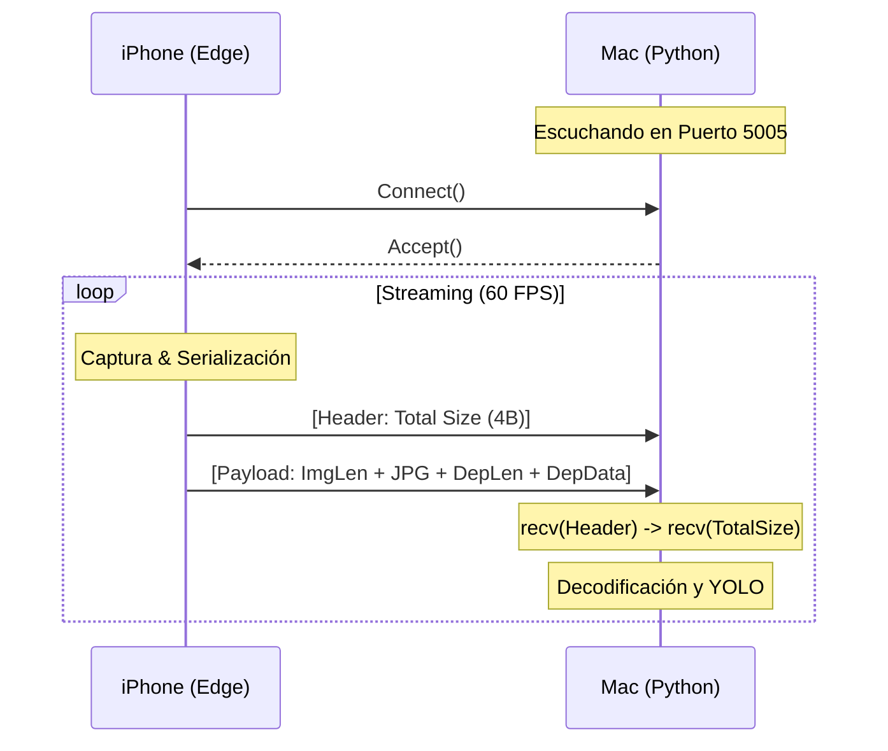

# Protocolo de Comunicación TCP: Edge Sensor

Este documento define las especificaciones técnicas del protocolo de comunicación personalizado utilizado para la transmisión de datos en tiempo real entre el cliente iOS (Edge Sensor) y el servidor de procesamiento (Python/YOLO).

## 1. Resumen Técnico

*   **Transporte:** TCP/IP (Socket Stream).
*   **Puerto por Defecto:** `5005`.
*   **Endianness:** Big Endian (`>`).
*   **Tipos de Datos:** Enteros sin signo de 32 bits (`uint32` / `>L`).

---

## 2. Estructura del Paquete (Packet Framing)

El protocolo utiliza un esquema de **"Length-Prefixed Framing"** (Entramado con prefijo de longitud) para manejar el flujo continuo de datos TCP.

### Capa de Transporte (Wire Format)

Cada transmisión se compone de dos partes secuenciales:

1.  **Cabecera de Transporte (4 Bytes):** Indica el tamaño total de la carga útil (Payload) que sigue.
2.  **Carga Útil (Payload - N Bytes):** Los datos binarios efectivos.

| Offset | Tamaño | Tipo | Descripción |
| :--- | :--- | :--- | :--- |
| 0 | 4 Bytes | `uint32` (BE) | **Total Packet Size**: Tamaño en bytes de todo el bloque de datos siguiente. |
| 4 | N Bytes | Binary | **Payload**: El contenido serializado (Imagen + Profundidad). |

---

## 3. Estructura de la Carga Útil (Payload Layout)

Dentro de la sección de `Payload`, se empaquetan secuencialmente la imagen RGB y el mapa de profundidad.

| Componente | Tamaño Fijo | Contenido Variable | Descripción |
| :--- | :--- | :--- | :--- |
| **Imagen** | 4 Bytes | *Variable* (N) | `[Image Length]` + `[Image Data (JPEG)]` |
| **Profundidad** | 4 Bytes | *Variable* (M) | `[Depth Length]` + `[Depth Data (Float32)]` |

### Detalle Byte a Byte

Imaginemos un payload de ejemplo. La estructura binaria interna es:

1.  **Image Length (4 Bytes):** Entero `uint32`. Indica el tamaño del archivo JPEG.
2.  **Image Data (N Bytes):** Flujo de bytes de la imagen (usualmente JPEG comprimido al 50%).
3.  **Depth Length (4 Bytes):** Entero `uint32`. Indica el tamaño del buffer de profundidad.
4.  **Depth Data (M Bytes):** Flujo de bytes raw (usualmente matriz Float32 serializada).

---

## 4. Diagrama de Secuencia



## 5. Implementación de Referencia (Python)

El siguiente fragmento ilustra cómo el servidor reconstruye el mensaje:

```python
# 1. Leer tamaño total del paquete
packed_msg_size = conn.recv(4)
msg_size = struct.unpack(">L", packed_msg_size)[0]

# 2. Leer payload completo
data = b""
while len(data) < msg_size:
    data += conn.recv(msg_size - len(data))

# 3. Decodificar Estructura Interna
offset = 0

# A. Extraer Imagen
img_len = struct.unpack(">L", data[offset:offset+4])[0]
offset += 4
image_bytes = data[offset:offset+img_len]
offset += img_len

# B. Extraer Profundidad (Si existe)
if len(data) > offset:
    depth_len = struct.unpack(">L", data[offset:offset+4])[0]
    offset += 4
    depth_data = data[offset:offset+depth_len]
```
